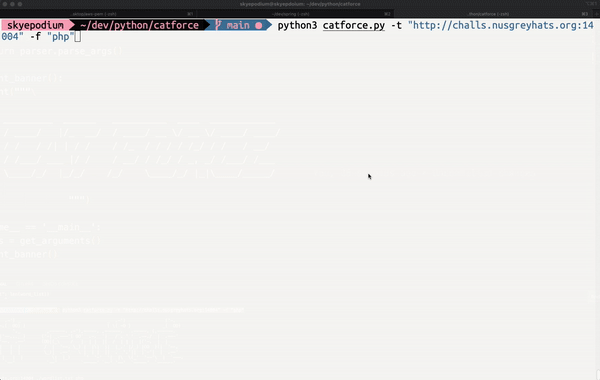

# catforce

# 1. 소개
CTF 대회용 웹 스캔 도구

# 2. 환경
- python3
- requests
- tqdm

# 3. 옵션

|옵션|설명|예시|필수 여부|
|-------|-----|-----|-----|
|-t| 타겟 도메인|https://www.example.com|O|
|-f|파일 확장자|php, html|X|
|-w|단어 리스트|./dev/1.txt|X|

# 4. 예시
`python3 catforce.py -t "http://challs.nusgreyhats.org:14004" -f "php"`

